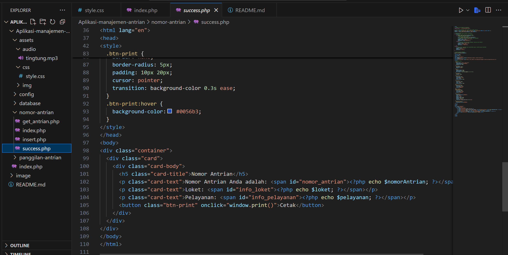
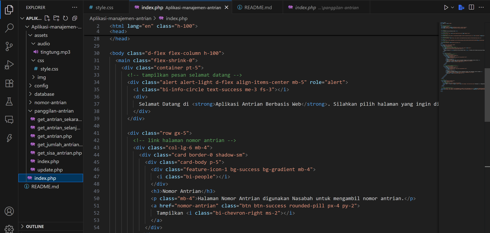
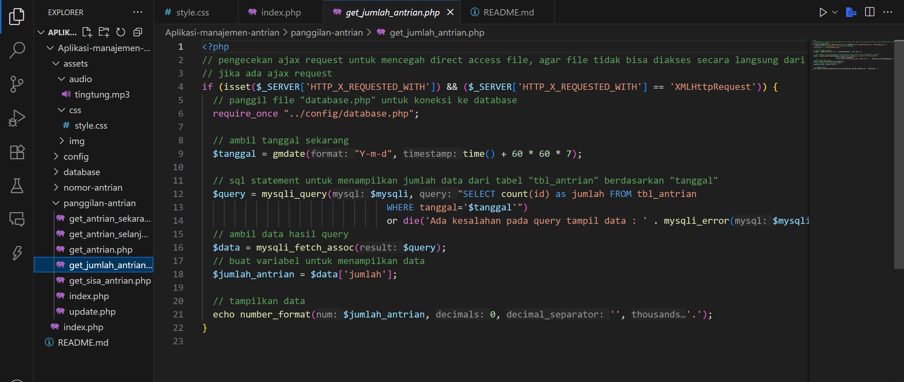

# KELOMPOK 3 APLIKASI MANAJEMEN ANTRIAN - PEMOGRAMAN WEB 2

## ANGGOTA KELOMPOK
| NO.|    NIM     |              NAMA                     |
|----|------------|---------------------------------------|
| 1. | 312310008  |   Miranda Oktavia Siagian             |
| 2. | 312310026  |   Niken Ayu Ristiani                  |   
| 3. | 312310066  |   Wahyu Wulan Oktavia                 |
| 4. | 312310018  |   Watmah                              |

KELAS : TI.23.C.1

MATA KULIAH : PEMOGRAMAN WEB 

DOSEN PENGAMPU : AGUNG NUGROHO,S.KOM., M.KOM

**A. Gambaran Umum Sistem** 

**Aplikasi Antrian Berbasis Web**

Aplikasi antrian berbasis web adalah sebuah sistem digital yang dirancang untuk mengelola proses antrian secara otomatis dan dapat diakses melalui jaringan internet menggunakan browser. Aplikasi ini memungkinkan pengguna untuk mengambil nomor antrian, memantau posisi dalam antrean, serta mendapatkan notifikasi atau informasi terkait layanan secara real-time tanpa harus datang langsung atau menunggu secara fisik di lokasi layanan.

Aplikasi manajemen antrian yang dirancang bertujuan untuk mengoptimalkan proses antrian dalam suatu sistem layanan, dengan fokus pada nasabah dan petugas. Sistem ini memfasilitasi nasabah untuk mengambil nomor antrian, memilih loket, memilih jenis layanan yang diinginkan, cetak nomer antrian dan menunggu dengan nyaman. Di sisi lain, sistem memberikan alat kepada petugas untuk memanggil nomor antrian secara efisien menggunakan suara

**Cara kerja aplikasi**
Aplikasi antrian berbasis web bekerja melalui beberapa tahapan berikut:

Pendaftaran Antrian, Manajemen Antrian , Pemanggilan Antrian
kemudian Petugas memanggil nomor antrian secara otomatis atau manual melalui sistem. Monitoring oleh Pengguna
dan Penyelesaian Layanan Setelah dilayani, data antrian ditandai sebagai selesai. Data ini disimpan dan dapat digunakan untuk laporan atau analisis

**fungsi aplikasi antrian**
1. Mengelola Antrian Secara Efisien

2. Meningkatkan Kualitas Pelayanan

3. Meminimalkan waktu tunggu dan meningkatkan kenyamanan pengguna layanan.

4. Memonitor Antrian Secara Real-Time
Baik oleh pengguna maupun petugas, sehingga transparan dan terkendali.

5. Mengurangi Beban Administratif , Tidak perlu menulis atau memanggil nomor antrian secara manual.

6. Akses Fleksibel , Dapat diakses dari mana saja selama ada koneksi internet.

7. Pencatatan & Laporan Otomatis . Data pengguna, waktu tunggu, jumlah layanan, dan lainnya dapat dikumpulkan untuk evaluasi dan peningkatan layanan.

**B. Kebutuhan Sistem** 

**Non functional** 

Analisis kebutuhan non fungsional dibagi menjadi dua, yaitu kebutuhan perangkat lunak dan kebutuhan perangkat keras. Perangkat keras bertujuan untuk memudahkan proses perancangan dan implementasi dalam pembangunan sistem ini.

•	Analisa Kebutuhan Perangkat Lunak

Analisis ini dibutuhkan untuk mengetahui spesifikasi minimum yang di butuhkan untuk membangun sebuah software.

Tabel 1 Tabel Spesifikasi Perangkat Lunak

|No. |Software Pendukung |
| - | - |
|1\. |Visual  Studio Code|
|2\. |Bahasa Program PHP,HTML,CSS,SQL |
|3\. |phpMyAdmin |
|4\. |XAMPP |
|5\. |Michrosoft edge |

•	Analisa Kebutuhan Perangkat Keras

Kebutuhan spesifikasi minimum perangkat keras yang dibutuhkan oleh pengguna untuk menjalankan aplikasi dapat dilihat pada Tabel dibawah ini :

Tabel 2 Kebutuhan Perangkat Keras Pengguna

|No. |Perangkat |
| - | - |
|1 |Printer |
|2 |Speaker |
|3 |Laptop |
|4 |Monitor |

**C. Data Base Aplikasi** 
Database dalam aplikasi antrian adalah komponen inti yang memastikan semua data terekam dan dikelola dengan baik. memungkinkan sistem bekerja otomatis, efisien, dan real-time, mulai dari pengambilan nomor hingga laporan akhir pelayanan.

Tabel 1 Tabel Struktur 
|No. |Kolom |Keterangan |
| - | - | - |
|1 |id |ID Nomor Antrian |
|2 |nama |Nama Pengguna |
|3 |no_antrian |Nomor Antrian |
|4 |waktu |Waktu Tunggu |
|5 |status |Status Layanan |
|6 |lama |Lama Layanan |
|7 |pelayanan selesai |pelayanan_selesai |

 ## data base pada visual studio code 

**D Nomor Antrian** 
Nomor antrian adalah kode unik yang diberikan kepada setiap pengguna saat mendaftar untuk mendapatkan layanan tertentu. Nomor ini berfungsi untuk menentukan urutan pelayanan secara adil dan teratur, serta membantu petugas maupun sistem dalam memanggil pengguna secara sistematis.

Nomor antrian biasanya terdiri dari kombinasi huruf dan angka, contohnya: 1, 11, atau hanya angka seperti 001, 002, tergantung jenis layanan atau kategori pengguna. Dalam sistem digital berbasis web, nomor antrian dihasilkan secara otomatis oleh sistem untuk menghindari duplikasi dan mempermudah proses pengelolaan antrian.

**Tampilan Dashboard Nomor Antrian** 

**Tampilan codingan Nomor Antrian** 

**Tampilan dasboard panggilan antrian** 

**Tampilan codingan panggilan antrian**

**E. Hasil Demo Akhir dari Aplikasi antrian** 

## Dengan selesainya pengembangan aplikasi data antrian berbasis web ini, kami mengucapkan terima kasih yang sebesar-besarnya kepada semua pihak yang telah mendukung dan berkontribusi, baik secara teknis maupun non-teknis. Semoga aplikasi ini dapat memberikan manfaat nyata dalam meningkatkan efisiensi layanan dan kenyamanan bagi para pengguna Sekian dan Terimakasih. 

